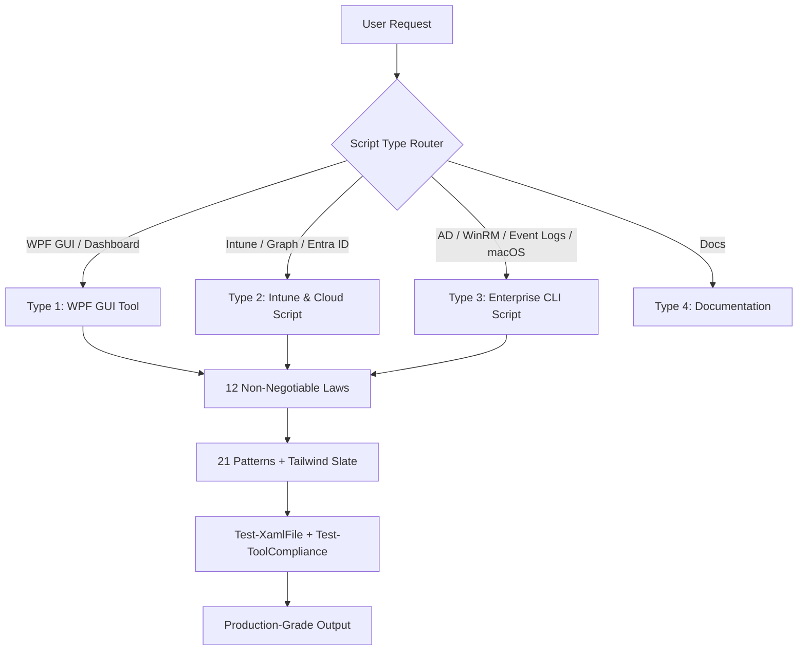

<div align="center">

# ⚡ PowerShell Enterprise Admin

### *Production Design & Automation Standard for AI Agents*

**The single standard that turns any coding agent into a senior PowerShell architect.**

[](https://learn.microsoft.com/en-us/powershell/)
[](#-platform-compatibility-matrix)
[](#-tailwind-slate-design-system)
[](#-core-capabilities)
[](#-evaluation--quality-gates)
[](#-evaluation--quality-gates)
[](#-license)
[](CHANGELOG.md)

> **One design language. Zero UI freezes. Predictable logs. A gate that actually blocks drift.**

*Distilled from production enterprise deployments — not from theory, but from bugs that shipped.*

[Quick Start](#-quick-start--30-seconds-for-any-ai-agent) • [The 12 Laws](#-the-12-non-negotiable-laws) • [21 Patterns](#-the-21-canonical-patterns) • [Design System](#-tailwind-slate-design-system)

</div>

---

## 📊 Executive KPI — What You Get on Day One

| KPI | Value | Guarantee |
|:---:| :---: | :--- |
| 🧪 **50** | Automated checks | `Test-Skill.ps1` validates AST, headers, tokens, styles, size budget |
| 🧩 **21** | Canonical patterns | Theme → HTML report — **copy, don’t invent** |
| 📜 **12** | Non-negotiable laws | Header → Report Path — violating one = **rejected** |
| 🎨 **19** | Required XAML styles | `BtnBase` → `SessionCard` — every tool looks like one product |
| ⚡ **<3s** | Launch to interactive | No splash, no freeze, STA auto-restart handled |
| 🛡️ **0** | Symbol-font dependencies | SVG `Path` only — renders on Server Core & locked-down builds |

---

# 🚀 Quick Start — 30 Seconds for Any AI Agent

> **Pick your agent, paste one command, and start generating production-grade PowerShell.**

| AI Agent | Scope | Install Command |
| :--- | :--- | :--- |
| **OpenCode** | Global — all projects | `Copy-Item -Recurse -Path .\powershell-enterprise-admin -Destination "$env:USERPROFILE\.config\opencode\skills\"` |
| **OpenCode** | Project-local | `Copy-Item -Recurse -Path .\powershell-enterprise-admin -Destination ".\.opencode\skills\"` |
| **Claude Code** | Global / Project | `Copy-Item -Recurse -Path .\powershell-enterprise-admin -Destination "$env:USERPROFILE\.claude\skills\"` or `".\.claude\skills\"` |
| **Cursor** | Project | `Copy-Item -Recurse -Path .\powershell-enterprise-admin -Destination ".\.cursor\skills\"` |
| **GitHub Copilot** | VS Code | Create `.github/muse-instructions.md` with: `When building PowerShell tools, adhere strictly to ./powershell-enterprise-admin/SKILL.md` |
| **Gemini CLI** | Global | `Copy-Item -Recurse -Path .\powershell-enterprise-admin -Destination "$env:USERPROFILE\.config\gemini\skills\"` |
| **Antigravity** | Global | `Copy-Item -Recurse -Path .\powershell-enterprise-admin -Destination "$env:USERPROFILE\.gemini\antigravity\skills\"` |
| **Windsurf / Aider / Continue / Any** | Any | Copy the `powershell-enterprise-admin` folder to your agent’s skills directory and point system instructions at `SKILL.md` |

**Verify in 10 seconds — every agent, same gate:**

```powershell
.\scripts\Test-Skill.ps1
# Expected: 50/50 PASS

.\scripts\Test-Delivery.ps1 -ScriptPath .\MyTool.ps1 -ReadmePath .\README.md -SmokeTest
# Parser + gate + PS 5.1 smoke test — the last command before you ship
```

> **Template Lock:** Every tool starts by copying a scaffold from `templates/` — customize only `[Placeholders]`/`TODO` and prove with the gate. Templates already pass.

---

## 📑 Table of Contents

- [⚡ PowerShell Enterprise Admin](#-powershell-enterprise-admin)
    - [*Production Design \& Automation Standard for AI Agents*](#production-design--automation-standard-for-ai-agents)
  - [📊 Executive KPI — What You Get on Day One](#-executive-kpi--what-you-get-on-day-one)
- [🚀 Quick Start — 30 Seconds for Any AI Agent](#-quick-start--30-seconds-for-any-ai-agent)
  - [📑 Table of Contents](#-table-of-contents)
- [📖 Overview](#-overview)
  - [🎯 Why This Standard Exists](#-why-this-standard-exists)
- [✨ Core Capabilities](#-core-capabilities)
    - [🔹 Modern WPF GUI — Tailwind Slate, Not WinForms](#-modern-wpf-gui--tailwind-slate-not-winforms)
    - [🔹 Intune \& Cloud Automation — Exit Codes Matter](#-intune--cloud-automation--exit-codes-matter)
    - [🔹 Enterprise Infrastructure — Bulk, Remote, Cross-Platform](#-enterprise-infrastructure--bulk-remote-cross-platform)
    - [🔹 Packaging \& Distribution — From `.ps1` to `.exe` to Gallery](#-packaging--distribution--from-ps1-to-exe-to-gallery)
- [💻 Platform Compatibility Matrix](#-platform-compatibility-matrix)
- [📜 The 12 Non-Negotiable Laws](#-the-12-non-negotiable-laws)
- [🧩 The 21 Canonical Patterns](#-the-21-canonical-patterns)
- [🎨 Tailwind Slate Design System](#-tailwind-slate-design-system)
- [📁 Repository Structure](#-repository-structure)
- [💡 Example Prompts \& Scenarios](#-example-prompts--scenarios)
- [🧪 Evaluation \& Quality Gates](#-evaluation--quality-gates)
    - [Self-Test — 50 checks](#self-test--50-checks)
    - [Compliance Gate — Identity Lock](#compliance-gate--identity-lock)
    - [Delivery Verifier — one command](#delivery-verifier--one-command)
    - [Scenario Evals — 25 cases](#scenario-evals--25-cases)
- [🔒 Security \& Compliance](#-security--compliance)
- [❓ FAQ](#-faq)
- [🤝 Contributing](#-contributing)
- [🙏 Acknowledgments \& Foundations](#-acknowledgments--foundations)
  - [📜 License](#-license)
  - [👤 Author](#-author)
  - [⚠ Disclaimer](#-disclaimer)
    - [⭐ Support the Project](#-support-the-project)

---

# 📖 Overview

**PowerShell Enterprise Admin** is an [OpenCode](https://opencode.ai) skill that enforces a single production standard across every PowerShell artifact an agent generates — WPF dashboards, Intune remediations, Graph automations, AD/WinRM/event-log CLIs, and macOS bash.

It was **distilled from shipping bugs**, not best-practice blogs:

| Without Standard | With Standard |
| :--- | :--- |
| Inconsistent headers → `Get-Help` useless | Canonical rich header — the file *is* the contract |
| Hardcoded `#3B82F6` → dark mode breaks | All colors via `{DynamicResource Token}` — toggle just works |
| `Segoe MDL2` glyph `&#xE7F4;` → empty box on Server | SVG `<Path Data>` — renders everywhere |
| `Start-Sleep` on dispatcher → “Not Responding” | `Start-Job` + `DispatcherTimer` — never blocks |
| `Test-Path` on ACL’d profile → `Access Denied` crash | Per-profile `try/catch` — graceful skip + DEBUG log |
| Invented `PrimaryButtonStyle` → theme drift at 1,400 lines | Identity Lock — `BtnPrimary` is a fixed API, gate blocks drift |

> **Every tool that passes the gate launches fast, never freezes, logs to one place, survives PS 5.1 quirks, and looks like it came from the same team — because it did.**

---

## 🎯 Why This Standard Exists

Enterprise PowerShell has no shortage of snippets. What it lacks is **a shared definition of done** that an AI can actually enforce. This skill provides:

* **Laws** — what you *must* do (and *why*, not just *what*)
* **Patterns** — *how* to do it (copy-paste, not prose)
* **Gates** — *proof* you did it (`Test-XamlFile` + `Test-ToolCompliance` with CI-ready exit codes)

No more “it runs on my machine.” If it fails the gate, it doesn’t ship.

---

# ✨ Core Capabilities



### 🔹 Modern WPF GUI — Tailwind Slate, Not WinForms

* **Async by design** — `Start-Job` / `[powershell]::BeginInvoke` + `DispatcherTimer` (300/350ms) — *zero* UI freezes, even for 10k-row CIM queries
* **Instant theme** — `Set-Theme` swaps 30+ `DynamicResource` tokens via `Remove+Add` (never indexer); Sun/Moon SVG paths, no font
* **Live terminal** — `LiveMessageCenterBox` (`#1E293B`, Consolas 12px) with per-entry `LineBreak` + duplicate guard + color-coded levels
* **Enterprise tables** — `DataGrid` theme (`TableBg/TableAltBg`, header 36px SemiBold, `AlternationCount 2`, hover `AccentTintBrush`, `CornerRadius 8` wrapper + count badge)
* **Process wrapper** — `Start-ProcessAsync` (`ProcessStartInfo` + runspace + polling) captures StdOut/StdErr without blocking; `Show-ToastMessage` replaces `MessageBox`

### 🔹 Intune & Cloud Automation — Exit Codes Matter

* Headers with `.REMEDIATIONTYPE` / `.PAIRSCRIPT` and truthful `.PERMISSIONS` (`None (local SYSTEM context)` vs real Graph scopes)
* **Exit contracts:** Detection `0=compliant / 1=non-compliant / 2=script error`, Remediation `0=success / 1=failure / 2=error` — never conflate crash with non-compliance
* **Graph resilience:** `Get-MgGraphAllPages` (pagination), `Invoke-GraphRequestWithRetry` (429 `Retry-After` / 5xx backoff), `$batch` (20 ops), `Get-Graph403Message` (403 → missing-role)
* **Azure Automation:** Managed Identity, portal-safe booleans, LAW ingestion, AppRole assignment

### 🔹 Enterprise Infrastructure — Bulk, Remote, Cross-Platform

* **AD** — bulk ops with `ConvertTo-SafeDateTime` (culture-invariant, no `en-US` assumption)
* **WinRM** — fan-out with classified errors, parallel throttling, per-host result objects
* **Event Logs** — `FilterHashtable` + XML property extraction, not `Where-Object` after the fact
* **macOS** — enterprise `bash` with `check_root` + structured `logger` + Intune exit semantics

### 🔹 Packaging & Distribution — From `.ps1` to `.exe` to Gallery

* Compile `.ps1` → `.exe` via Enterprise patterns engine (CodeDOM, GZip+Base64 XAML, P/Invoke console-hide, `%APPDATA%` settings)
* Authenticode signing with timestamp, icon embedding, `Install-Script` publishing
* Intune Custom Compliance (JSON `Compliant:Boolean` contract) + Government cloud Graph endpoints

---

# 💻 Platform Compatibility Matrix

> Canonical matrix: `SKILL.md` → *Enterprise Platform & Compatibility Matrix* + `references/_graph-canonical.md`.

| OS | PowerShell | WPF GUI (Type 1) | Intune (Type 2) | CLI (Type 3) | Notes |
| :--- | :---: | :---: | :---: | :---: | :--- |
| **Windows 11 22H2–24H2** | 5.1 / 7.4+ | ✅ Full | ✅ Full | ✅ Full | WinRT toasts, native STA |
| **Windows 10 21H2–22H2** | 5.1 / 7.4+ | ✅ Full | ✅ Full | ✅ Full | Standard enterprise base |
| **Windows Server 2025/2022** | 5.1 / 7.4+ | ✅ Full | ⚠️ Arc | ✅ Full | Desktop Experience for WPF |
| **Windows Server 2019/2016** | 5.1 | ✅ Full | ⚠️ Arc | ✅ Full | SVG paths — no Fluent font |
| **macOS Sonoma/Sequoia** | Bash 3.2+ / zsh | ❌ — | ✅ Intune macOS | ✅ Shell | `references/macos-patterns.md` |
| **Azure Automation** | 5.1 / 7.2 | ❌ Headless | ✅ Runbooks | ✅ Hybrid Worker | 400MB / 3h limits |

---

# 📜 The 12 Non-Negotiable Laws

> **Violating one = rejected. No exceptions. Each law has a postmortem behind it.**

| # | Law | Rule | Impact |
|:-:| :--- | :--- | :--- |
| 1 | **HEADER** | Canonical rich header first; `#Requires -Version 5.1` immediately after; `RunAsAdministrator` banned — `Test-IsElevated` at runtime | Header is the contract; partial work survives |
| 2 | **NAMING** | `Verb-Noun` functions, `camelCase` locals, `$script:PascalCase` state, `$btn/` `$txt/` controls | Every tool reads the same |
| 3 | **NO ALIASES** | Full cmdlet names only — no `gci`, `%`, `?`, `select` | Intent stays greppable |
| 4 | **ERROR** | `$ErrorActionPreference='Stop'`; typed catches; never empty `catch {}` | Failures surface with real cause |
| 5 | **COLOR** | All bg/surface/text/border via `{DynamicResource Token}` | Theme toggle just works |
| 6 | **ICON** | SVG `<Path Data>` only — MDL2/Fluent banned | No empty boxes on Server |
| 7 | **SIDEBAR** | Sidebar = Logo + Nav + Version footer; system controls in header | Consistent layout |
| 8 | **THREAD** | Never block dispatcher — `Start-Job` / runspace + timer | No “Not Responding” |
| 9 | **AMPERSAND** | Every `&` in XAML is `&amp;` | Kills #1 ShowDialog crash |
| 10 | **STATICRESOURCE** | Every `{StaticResource X}` has a defined `<Style x:Key="X">` | No resource exception |
| 11 | **LANGUAGE & BRANDING** | English-only; no external branding; `.AUTHOR AI Generated` | Clean parsers & CI |
| 12 | **REPORT PATH** | Reports beside script via `$PSScriptRoot` fallback chain — never bare `.\Reports` | Dot-sourcing never crashes |

*Full rationale + enforcement via `scripts/Test-ToolCompliance.ps1` — see [`SKILL.md`](SKILL.md) The 12 Laws.*

---

# 🧩 The 21 Canonical Patterns

|  | Name | Purpose | Copy from |
| :--- | :--- | :--- | :--- |
| A | Theme Toggle | Sun/Moon + `Set-Theme` ( `Remove+Add` ) | `patterns.md` |
| B | Background Data Load | `Start-Job` + 300ms timer for CIM/Graph | `patterns.md` |
| C | Async Runspace | `BeginInvoke` + 350ms timer for .NET work | `patterns.md` |
| D | Inline XAML Dialog | Modal without own file | `patterns.md` |
| E | LogViewer Theme Copy | Child inherits theme via `Remove+Add` | `patterns.md` |
| F | Drag & Drop | `AllowDrop="True"` file inputs | `patterns.md` |
| G | Select All DataGrid | Bulk row-check | `patterns.md` |
| H | Guard-Action | Atomic busy guard — **every button** | `scripts/Guard-Action.ps1` |
| I | Set-UIState | Disable + indeterminate progress | `patterns.md` |
| J | Central Refresh | One function owns derived UI | `patterns.md` |
| K | Clock Timer | Live StatusBar clock | `patterns.md` |
| L | Toast | Animated `Show-ToastMessage` (not MessageBox) | `patterns.md` |
| M | About (Concise) | Hero + 3 Highlights + Requirements/Author + Disclaimer | `patterns.md` |
| N | Live Column Filter | Per-column DataGrid search | `patterns.md` |
| O | Shift-Click Range | Excel-like multi-check | `patterns.md` |
| P | Multi-Input Parsing | Comma/newline terms | `patterns.md` |
| Q | Settings Persistence | `%LOCALAPPDATA%\settings.json` | `patterns.md` |
| R | Async Process Wrapper | `ProcessStartInfo` + runspace, no block | `patterns.md` |
| S | Live Message Center | `RichTextBox` terminal — **each entry ends with `LineBreak`** | `patterns.md` |
| T | Native OS Toasts | WinRT Action Center, zero modules | `patterns.md` |
| U | Executive HTML Report | **Premium hero + KPI icons + progress bars + search + print** | `patterns.md` |

> Full code for each: [`references/patterns.md`](references/patterns.md) — templates already embed the canonical implementations.

---

# 🎨 Tailwind Slate Design System

> **Tokens are the API** — hardcoding hex outside semantic constants breaks dark mode. `Set-Theme` swaps every token via `Remove+Add` (never indexer).

```xml
<SolidColorBrush x:Key="BackgroundBrush" Color="#F1F5F9"/> <!-- Dark: #1E293B -->
<SolidColorBrush x:Key="SurfaceBrush"    Color="#FFFFFF"/> <!-- Dark: #334155 -->
<SolidColorBrush x:Key="BorderBrush"     Color="#E2E8F0"/> <!-- Dark: #475569 -->
<SolidColorBrush x:Key="AccentBrush"     Color="#3B82F6"/> <!-- Dark: #60A5FA -->
<SolidColorBrush x:Key="SuccessBrush"    Color="#10B981"/>
<SolidColorBrush x:Key="WarningBrush"    Color="#F59E0B"/>
<SolidColorBrush x:Key="DangerBrush"     Color="#EF4444"/>
```

**Design Tokens Preview**

| Token | Light | Dark | Use |
| :--- | :--- | :--- | :--- |
| `BackgroundBrush` | `#F1F5F9` | `#1E293B` | Window |
| `SurfaceBrush` | `#FFFFFF` | `#334155` | Cards, inputs |
| `BorderBrush` | `#E2E8F0` | `#475569` | Borders |
| `TextPrimaryBrush` | `#0F172A` | `#FFFFFF` | Headings |
| `AccentBrush` | `#3B82F6` | `#60A5FA` | Primary |
| `Success/Warning/Danger` | `#10B981/#F59E0B/#EF4444` | same | Semantic (hardcoded allowed) |

**Spacing & Typography** — Segoe UI Variable, 11–28pt, `Card 18/14`, `Button 38/34`, `CornerRadius 14/10/8`, `DropShadow Blur 24 Opacity .045` — full scale: [`references/design-tokens.md`](references/design-tokens.md)

**19 Required Styles** (`Window.Resources`):

```text
Buttons:     BtnBase, BtnPrimary, BtnBlue, BtnGreen, BtnRed, BtnPurple, BtnGhost,
             BtnOutline, BottomActionBtn, NavBtnBase
Containers:  Card, StatCard, SessionCard
Inputs:      FieldLabel, InputBox, InputBoxNoHover, StyledCheckBox, StyledComboBox
Console:     LiveMessageCenterBox
+ Enterprise DataGrid theme: DataGrid / DataGridColumnHeader / DataGridRow / DataGridCell
```

Full XAML: [`references/xaml-styles.md`](references/xaml-styles.md)

---

# 📁 Repository Structure

```text
powershell-enterprise-admin/
├── SKILL.md                      # Full enterprise specification & 12 Laws
├── README.md                     # This executive guide (you are here)
├── LICENSE                       # MIT
├── CHANGELOG.md                  # Keep a Changelog history
├── lessons-learned.md            # GLOBAL register — one file for every project
├── scripts/                      # 14 canonical modules & gates
│   ├── Add-LogLine.ps1           # GUI log — duplicate guard + file + UI + LineBreak
│   ├── Write-Log.ps1             # CLI log — Initialize-Log / Write-Log / Finish-Script
│   ├── Guard-Action.ps1          # Pattern H — verbatim copy
│   ├── Get-MgGraphAllPages.ps1   # Graph pagination
│   ├── Invoke-GraphRequestWithRetry.ps1  # 429/5xx resilience
│   ├── Invoke-GraphBatchRequest.ps1      # $batch 20 ops
│   ├── Get-Graph403Message.ps1   # 403 → missing-role
│   ├── ConvertTo-SafeDateTime.ps1
│   ├── Connect-GraphAuth.ps1
│   ├── Embed-Xaml.ps1            # Tier 3 GZip+Base64 embedder
│   ├── Test-XamlFile.ps1         # Dual-engine validator
│   ├── Test-ToolCompliance.ps1   # Identity Lock gate (CI exit codes)
│   ├── Test-Skill.ps1            # 50-check self-test
│   └── Test-Delivery.ps1         # Parser + gate + PS 5.1 smoke test
├── references/                   # 20 architecture & domain guides
│   ├── _header-canonical.md      # Header field order (single source)
│   ├── _logging-canonical.md     # Logging contexts, levels & colors
│   ├── _graph-canonical.md       # Graph pagination/retry/batch/auth
│   ├── file-architecture.md      # Tier 1/2/3 + Modular Tier 3
│   ├── design-tokens.md          # Full Slate tokens + spacing
│   ├── xaml-styles.md            # Full XAML for 19 styles + DataGrid theme
│   ├── patterns.md               # Code for Patterns A–U (premium HTML included)
│   ├── pitfalls.md               # 25+ production-debugged PS 5.1 crash causes
│   ├── icons.md                  # Vector SVG path library (no font)
│   ├── script-template.md
│   ├── intune-patterns.md
│   ├── notification-patterns.md
│   ├── ad-patterns.md / winrm-patterns.md / event-log-patterns.md / macos-patterns.md
│   ├── readme-template.md        # 4 README variants — badges + Disclaimer
│   ├── exe-packaging.md
│   └── advanced-capabilities.md
├── templates/                    # 11 copy-paste scaffolds (TEMPLATE LOCK)
│   ├── wpf-gui-tool.template.ps1 # All 19 styles + DataGrid theme + concise About + LineBreak
│   ├── cli-tool.template.ps1
│   ├── intune-detect.template.ps1 / intune-remediate.template.ps1
│   └── readme-*.template.md (4)
└── evals/evals.json              # 25 scenario evals
```

---

# 💡 Example Prompts & Scenarios

| Category | Prompt | Routing |
| :--- | :--- | :--- |
| **WPF GUI Tool** | *“Build a WPF tool to manage Entra ID users with search filtering, Dark/Light mode, and a DataGrid.”* | **Type 1 · Tier 1** |
| **Intune Remediation** | *“Create a proactive remediation pair that detects and disables TLS 1.0/1.1.”* | **Type 2 · Intune** |
| **Graph Automation** | *“Export all Intune devices and their BitLocker keys to CSV.”* | **Type 2 · Graph** |
| **AD CLI** | *“Find inactive AD accounts (>90 days) and disable with WhatIf.”* | **Type 3 · AD** |
| **Multi-Machine** | *“Run a command on 50 servers and show results in a grid.”* | **Type 3 · WinRM** |
| **macOS** | *“Write a bash script for Intune to configure dock and log to /var/log/.”* | **Type 3 · macOS** |
| **Docs** | *“Write a README for this tool.”* | **Type 4 · Documentation** |

---

# 🧪 Evaluation & Quality Gates

### Self-Test — 50 checks

```powershell
.\scripts\Test-Skill.ps1
# AST parse, header order, #Requires placement, ValidateSet, tokens, styles, size budget
# Expected: 50/50 PASS — the skill tests itself
```

### Compliance Gate — Identity Lock

```powershell
.\scripts\Test-ToolCompliance.ps1 -ToolPath .\MyTool.ps1 [-ReadmePath .\README.md]
# Symbol fonts, invented style keys, missing guards, StatusBar quartet, README badges/disclaimer
# Exit codes are CI-ready: 0=COMPLIANT, 1=NON-COMPLIANT
```

### Delivery Verifier — one command

```powershell
.\scripts\Test-Delivery.ps1 -ScriptPath .\MyTool.ps1 -ReadmePath .\README.md -SmokeTest
# Parser + gate + PS 5.1 smoke test — the last command before you ship
```

### Scenario Evals — 25 cases

```text
[✓] 9  WPF GUI Tools — theme, async, DataGrids, process wrapper, premium HTML, concise About
[✓] 8  Intune / Graph — remediation pairs, notifications, $batch, Managed Identity, LAW
[✓] 6  CLI & macOS — AD bulk, WinRM, event logs, inventory, bash
[✓] 1  Documentation — README generation (4 variants)
[✓] 1  Universal — culture-safe date parsing
```

---

# 🔒 Security & Compliance

* **English-only, no external branding** — `Law 11` — parsers, grep, and CI stay clean
* **Least privilege** — `.PERMISSIONS` lists real Graph scopes or `None (local SYSTEM context)` — never invented scopes
* **No secrets in settings** — `SettingsPersistence` (`%LOCALAPPDATA%\settings.json`) never stores passwords or client secrets
* **Auth matrix** — Managed Identity (Automation), Interactive/DeviceCode (local), Client Credentials (service) — `Connect-GraphAuth.ps1`
* **Government clouds** — Graph endpoints table in `_graph-canonical.md` (Commercial / GCC / GCC-High / DoD)

---

# ❓ FAQ

**Q: Why does `Get-Help` show nothing on generated scripts?**
A: The canonical rich header (`.TITLE` / `.TAGS` / `.REMEDIATIONTYPE` ...) is machine-readable, not comment-help. One unrecognized dotted keyword aborts help association — this is an accepted trade-off (see `pitfalls.md` → *Get-Help trade-off*). Add a separate `about_*.txt` if you need inline help.

**Q: Can I use `Segoe MDL2 Assets` if Fluent isn’t available?**
A: No — both are banned (`Law 6`). They render as empty boxes on Server Core and locked-down builds and can’t recolor via `Path.Fill="{DynamicResource AccentBrush}"`. Use SVG `Path` from `icons.md`.

**Q: Do I need Tier 3 for a simple tool?**
A: No. 80% of tools are Tier 1 single-file. Use Tier 3 (Modular) only for 5+ features, drag-drop, bundling, or persistent settings.

**Q: Why does the HTML report need a premium hero?**
A: The minimal flat header is visually indistinguishable from internal debug output. The premium hero (gradient + KPI icons + progress bars + search + print) is what executives actually forward.

---

# 🤝 Contributing

1. Fork and create a feature branch (`git checkout -b feature/new-pattern`)
2. Ensure `.\scripts\Test-Skill.ps1` passes with **0 failures**
3. New laws/patterns go through the canonical single source first (`_header/_logging/_graph-canonical.md`) — never duplicate
4. Commit clearly and open a Pull Request

> After any structural change, run `Test-Skill.ps1` **and** grep for stale counts (“10 Laws”, old names) across `SKILL.md` + `references/` + `README.md`.

---

# 🙏 Acknowledgments

This skill was distilled from production enterprise patterns across WPF automation, Intune remediation, Graph integration, and cross-platform scripting — refined through real-world deployments and postmortems. No external dependencies or third-party branding remain; only proven patterns are retained.

---

## 📜 License

This project is licensed under the [MIT License](LICENSE).

---

## 👤 Author

**Mohammad Abdulkader Omar**  
GitHub: [@mabdulkadr](https://github.com/mabdulkadr) · Website: [momar.tech](https://momar.tech)  
Version: **1.1.0**  

---

## ⚠ Disclaimer

This skill and every script it generates are provided as-is with no warranty of any kind. Test generated tools in a staging environment before deploying to production. The authors assume no liability for any damage or data loss resulting from their use.

---
<div align="center">

### ⭐ Support the Project

**If this tool saved you time, please star the repository** — it helps others discover it.

[Report an Issue](../../issues) · [momar.tech](https://momar.tech)

[](https://www.buymeacoffee.com/mabdulkadrx)

> **PowerShell Enterprise Admin** — *Enterprise PowerShell Tooling*

</div>
