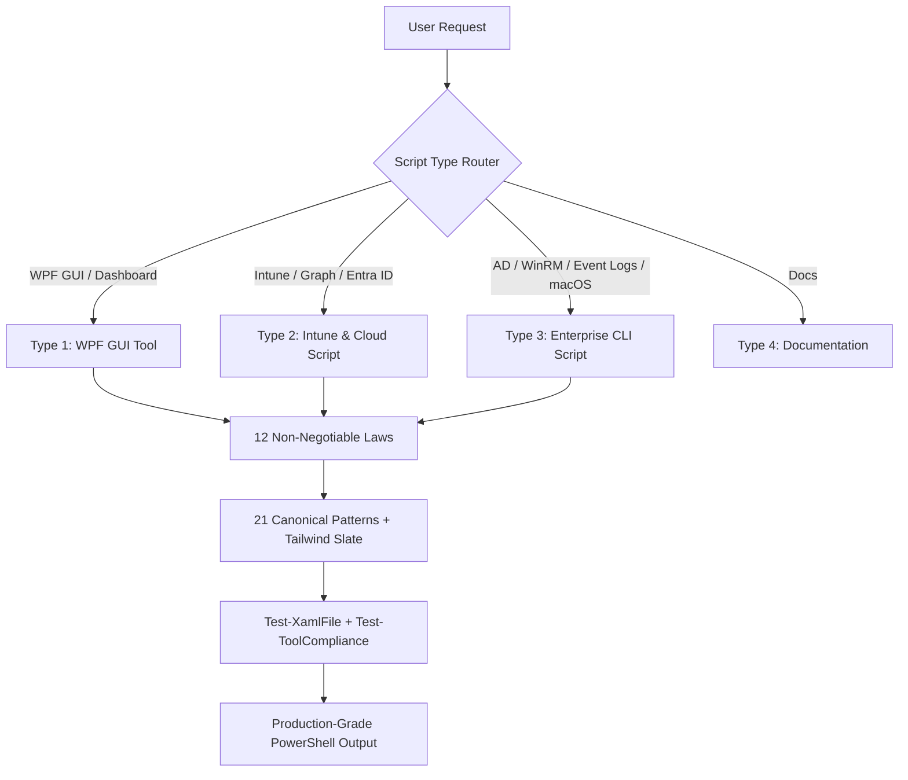

# ⚡ PowerShell Enterprise Admin – Production Design & Automation Standard for AI Agents


[](https://www.buymeacoffee.com/mabdulkadrx)

---

## 📑 Table of Contents

| | | |
| :--- | :--- | :--- |
| [Overview](#-overview) | [Core Capabilities](#-core-capabilities) | [Platform Compatibility](#-platform-compatibility-matrix) |
| [The 12 Laws](#-the-12-non-negotiable-laws) | [The 21 Patterns](#-the-21-canonical-patterns) | [Design System](#-tailwind-slate-design-system) |
| [Repository Structure](#-repository-structure) | [Quick Start & Install](#-quick-start--installation) | [Example Prompts](#-example-prompts--scenarios) |
| [Evaluation & Quality Gates](#-evaluation--quality-gates) | [Contributing](#-contributing) | [Acknowledgments](#-acknowledgments--foundations) |

---

# 📖 Overview

**PowerShell Enterprise Admin** is an [OpenCode](https://opencode.ai) skill that transforms AI coding agents into senior PowerShell system architects.

Enterprise PowerShell often suffers from inconsistent styling, UI freezes on long-running tasks, missing error logging, hardcoded colors breaking dark mode, unhandled Graph API throttling, and **naming drift** — where a model invents `PrimaryButtonStyle` instead of copying the canonical `BtnBase`. This skill eliminates those pitfalls by enforcing:

* 📜 **12 Non-Negotiable Laws** — each explained with *why it matters*, not just what
* 🔒 **Identity Lock** — canonical names treated as a fixed API, enforced by an automated compliance gate
* 🧩 **21 Battle-Tested Patterns** — theme toggle, async runspaces, DataGrid filtering, native toasts, HTML reports
* 🎨 **Tailwind Slate Design System** — 19 required XAML styles, light/dark tokens, spacing and typography scale
* 📚 **Canonical single-source references** — header/logging/Graph rules live in exactly one file each

Every tool generated with this standard launches fast, never freezes the UI thread, logs to a predictable location, survives PS 5.1 quirks, and passes its own compliance gate before delivery.

---

# ✨ Core Capabilities



### 🔹 Modern WPF GUI Applications
* Async execution via STA runspaces and background jobs (`DispatcherTimer` polling) — zero UI freezes
* Instant dark/light theme switching through dynamic resource tokens
* In-app colorized live terminal (`LiveMessageCenterBox`) and sidebar session elevation pill
* Non-blocking external process wrapper (`Start-ProcessAsync`) with real-time output capture

### 🔹 Intune & Cloud Automation
* Enterprise headers with `.REMEDIATIONTYPE`, `.PAIRSCRIPT`, and truthful `.PERMISSIONS`
* Exit-code contracts: Detection `0/1/2` (compliant / non-compliant / script error), Remediation `0/1/2`
* Graph resilience: pagination (`Get-MgGraphAllPages`), throttling retry (`Invoke-GraphRequestWithRetry`), bulk `$batch` engine, 403 → missing-role guidance (`Get-Graph403Message`)
* Azure Automation: Managed Identity auth, portal-safe boolean parameters, LAW telemetry ingestion, AppRole assignment automation

### 🔹 Enterprise Infrastructure
* Active Directory bulk operations with culture-safe date parsing (`ConvertTo-SafeDateTime`)
* Multi-host WinRM orchestration with classified error handling
* High-performance Event Log queries (`FilterHashtable` + XML property extraction)
* macOS enterprise bash scripts with root verification and structured logging

### 🔹 Packaging & Distribution
* Compile `.ps1` → `.exe` via the PSWrap engine (CodeDOM, managed-resource embedding, assembly metadata)
* Authenticode code signing with timestamp servers; PSGallery `Install-Script` publishing
* Intune Custom Compliance discovery scripts (JSON output contract + settings definition)

---

# 💻 Platform Compatibility Matrix

| Operating System | PowerShell | WPF GUI (Type 1) | Intune Remediation (Type 2) | Enterprise CLI (Type 3) |
| :--- | :---: | :---: | :---: | :---: |
| Windows 11 (22H2–24H2) | 5.1 / 7.4+ | ✅ Full | ✅ Full | ✅ Full |
| Windows 10 (21H2–22H2) | 5.1 / 7.4+ | ✅ Full | ✅ Full | ✅ Full |
| Windows Server 2025/2022 | 5.1 / 7.4+ | ✅ Desktop Experience | ⚠️ Hybrid Azure Arc | ✅ Full |
| Windows Server 2019/2016 | 5.1 | ✅ SVG icons only | ⚠️ Hybrid Azure Arc | ✅ Full |
| macOS (Sonoma / Sequoia) | Bash 3.2+ / zsh | ❌ n/a | ✅ Via Intune macOS | ✅ Shell |
| Azure Automation | 5.1 / 7.2 | ❌ Headless | ✅ Runbooks | ✅ Hybrid Worker |

---

# 📜 The 12 Non-Negotiable Laws

> ⚠️ Violating any law = the tool is rejected. No exceptions.

| # | Law | Rule | Impact |
| :-: | :--- | :--- | :--- |
| 1 | **HEADER** | Canonical rich header opens every `.ps1`; `#Requires -Version 5.1` right after; `#Requires -RunAsAdministrator` banned — detect elevation at runtime | Header is the API contract; partial-work runs survive |
| 2 | **NAMING** | `Verb-Noun` functions, `camelCase` locals, `$script:PascalCase` state, prefixed UI controls | Every tool reads the same |
| 3 | **NO ALIASES** | Full cmdlet names only — no `gci`, `%`, `?`, `select` | Intent stays greppable |
| 4 | **ERROR** | `$ErrorActionPreference = 'Stop'`; specific catches; never empty `catch {}` | Failures surface with the real cause |
| 5 | **COLOR** | All bg/surface/text/border via `{DynamicResource Token}` | Dark/light toggle just works |
| 6 | **ICON** | SVG `<Path Data>` only — Segoe MDL2 / Fluent / UI Symbol fonts forbidden | No empty boxes on Server or locked-down builds |
| 7 | **SIDEBAR** | Sidebar = Logo + Nav + Version footer only; system controls live in the header | Consistent layouts across tools |
| 8 | **THREAD** | Never block the dispatcher; `Start-Job` / async runspace + timer polling | No "Not Responding" windows |
| 9 | **AMPERSAND** | Every `&` in XAML is `&amp;` | Kills the #1 silent ShowDialog crash |
| 10 | **STATICRESOURCE** | Every `{StaticResource X}` has a matching defined key | No runtime resource exceptions |
| 11 | **LANGUAGE & BRANDING** | English-only output; no external branding; `.AUTHOR AI Generated` | Clean parsers, grep, CI |
| 12 | **REPORT PATH** | Reports anchored beside the script via `$PSScriptRoot` fallback chain — never bare `.\Reports` | Dot-sourcing never crashes |

---

# 🧩 The 21 Canonical Patterns

| Pattern | Name | Purpose |
| :---: | :--- | :--- |
| A | Theme Toggle | Sun/moon icon swap + full token override |
| B | Background Data Load | `Start-Job` + `DispatcherTimer` for CIM/WMI/Graph |
| C | Async Runspace | `BeginInvoke` + polling for in-process .NET work |
| D | Inline XAML Dialog | Modal forms without their own file |
| E | LogViewer Theme Copy | Child windows inherit active theme |
| F | Window-Level Drag & Drop | File path inputs accept drops |
| G | Select All DataGrid | Bulk row-check operations |
| H | Guard-Action | Atomic busy guard on every button |
| I | Set-UIState Busy/Idle | Disable controls + indeterminate progress |
| J | Central Refresh | One function owns derived UI state |
| K | Clock Timer | Live status-bar clock |
| L | Toast Messages | Replace blocking MessageBox |
| M | Markdown About Dialog | Render docs/*.md as WPF elements |
| N | Live Column Filtering | Per-column DataGrid search |
| O | Shift-Click Range Selection | Excel-like multi-row check |
| P | Multi-Input Parsing | Comma/newline search terms |
| Q | Settings Persistence | Safe JSON in %LocalAppData% |
| R | Async Process Wrapper | Non-blocking .exe capture of StdOut/StdErr |
| S | Live Message Center | Colorized RichTextBox terminal |
| T | Native OS Toasts | WinRT Action Center notifications, zero modules |
| U | Executive HTML Report | Self-contained responsive dashboard |

Full implementations: [`references/patterns.md`](references/patterns.md).

---

# 🎨 Tailwind Slate Design System

Every color, spacing value, and font size is a token. Hardcoding hex outside semantic constants breaks dark mode.

```xml
<SolidColorBrush x:Key="BackgroundBrush" Color="#F1F5F9"/> <!-- Dark: #1E293B -->
<SolidColorBrush x:Key="SurfaceBrush"    Color="#FFFFFF"/> <!-- Dark: #334155 -->
<SolidColorBrush x:Key="BorderBrush"     Color="#E2E8F0"/> <!-- Dark: #475569 -->
<SolidColorBrush x:Key="AccentBrush"     Color="#3B82F6"/>
<SolidColorBrush x:Key="SuccessBrush"    Color="#10B981"/>
```

### The 19 Required XAML Styles

```text
├── Buttons: BtnBase, BtnPrimary, BtnBlue, BtnGreen, BtnRed, BtnPurple, BtnGhost,
│             BtnOutline, BottomActionBtn, NavBtnBase
├── Containers: Card, StatCard, SessionCard
├── Input Controls: FieldLabel, InputBox, InputBoxNoHover, StyledCheckBox, StyledComboBox
└── Console: LiveMessageCenterBox
```

Full token set: [`references/design-tokens.md`](references/design-tokens.md) · Full XAML: [`references/xaml-styles.md`](references/xaml-styles.md)

---

# 📁 Repository Structure

```text
powershell-enterprise-admin/
│
 ├── SKILL.md                          # Full enterprise skill specification & rules
 ├── README.md                         # This guide
 ├── LICENSE                           # MIT
 ├── CHANGELOG.md                      # Release history (Keep a Changelog)
 ├── lessons-learned.md                # GLOBAL lessons register (travels with the skill)
 │
 ├── scripts/                          # 13 canonical modules & quality gates
 │   ├── Add-LogLine.ps1               # GUI logging (duplicate guard + disk file + UI)
 │   ├── Write-Log.ps1                 # CLI logging (Initialize-Log / Write-Log / Finish-Script)
 │   ├── Guard-Action.ps1             # Pattern H: atomic button busy guard
 │   ├── Get-MgGraphAllPages.ps1       # Graph @odata.nextLink pagination
 │   ├── Invoke-GraphRequestWithRetry.ps1  # 429 Retry-After aware / 5xx exponential backoff
 │   ├── Invoke-GraphBatchRequest.ps1  # $batch engine (20 ops per POST)
 │   ├── Get-Graph403Message.ps1       # 403 → actionable missing-role mapping
 │   ├── ConvertTo-SafeDateTime.ps1    # Culture-safe invariant date parser
 │   ├── Connect-GraphAuth.ps1         # Multi-mode Graph auth matrix
 │   ├── Embed-Xaml.ps1                # Tier 3 build step: GZip+Base64 XAML embedder
 │   ├── Test-XamlFile.ps1             # Dual-engine XAML syntax validator
 │   ├── Test-ToolCompliance.ps1       # Identity Lock compliance gate (CI-ready exit codes)
 │   └── Test-Skill.ps1                # Skill self-test (AST parse, headers, lints)
 │
 ├── references/                       # 20 architecture & domain guides
 │   ├── _header-canonical.md          # Single source: header field order
 │   ├── _logging-canonical.md         # Single source: logging contexts, levels & colors
 │   ├── _graph-canonical.md           # Single source: Graph pagination/retry/batch/auth
 │   ├── file-architecture.md          # Tier 1/2/3 scaffolds + Tier 1 bootstrap
 │   ├── design-tokens.md              # Complete Tailwind Slate token specifications
 │   ├── xaml-styles.md                # Full XAML for all 19 required styles
 │   ├── patterns.md                   # Code for Patterns A–U
 │   ├── pitfalls.md                   # 20+ production-debugged PS 5.1 crash causes
 │   ├── icons.md                      # Vector SVG path library
 │   ├── script-template.md            # CLI headers, ShouldProcess, quality bars
 │   ├── intune-patterns.md            # Remediation pairs, Graph patterns, LAW ingestion
 │   ├── notification-patterns.md      # Azure Automation runbooks + HTML email alerts
 │   ├── ad-patterns.md                # Active Directory management
 │   ├── winrm-patterns.md             # Multi-node remote management
 │   ├── event-log-patterns.md         # High-performance event log queries
│   ├── ad-patterns.md                # Active Directory management
│   ├── winrm-patterns.md             # Multi-node remote management
│   ├── event-log-patterns.md         # High-performance event log queries
│   ├── macos-patterns.md             # Enterprise bash for macOS
│   ├── readme-template.md            # 4 professional README variants
│   ├── exe-packaging.md              # Compile to EXE, code signing, icons, PSGallery
│   ├── advanced-capabilities.md      # Communication style + advanced scenarios
│   └── lessons-learned.md            # Register format, triggers, worked example
 │
 ├── .github/workflows/               # CI: skill self-test + compliance gate on push/PR
 └── evals/
     └── evals.json                    # 25 scenario evaluation test cases
```

---

# 🚀 Quick Start & Installation

### Option 1: OpenCode Skill Installation

```powershell
# Install globally for all OpenCode sessions
Copy-Item -Recurse -Path .\powershell-enterprise-admin -Destination "$env:USERPROFILE\.config\opencode\skills\"

# Or install for the current project only
Copy-Item -Recurse -Path .\powershell-enterprise-admin -Destination ".\.opencode\skills\"
```

### Option 2: Antigravity / Gemini Agent Installation

```powershell
Copy-Item -Recurse -Path .\powershell-enterprise-admin -Destination "$env:USERPROFILE\.gemini\antigravity\skills\"
```

### Option 3: Claude Desktop / Cursor / Copilot

Point your project's system instructions at the skill:

```markdown
When building PowerShell tools, scripts, or Intune remediations, adhere strictly to the
PowerShell Enterprise Admin standard in ./powershell-enterprise-admin/SKILL.md.
```

---

# 💡 Example Prompts & Scenarios

| Category | Example User Prompt | Routing |
| :--- | :--- | :--- |
| WPF GUI Tool | *"Build me a WPF tool to manage Entra ID users with search filtering, Dark/Light mode, and a DataGrid."* | **Type 1 · Tier 1** |
| Intune Remediation | *"Create a proactive remediation pair that detects and disables TLS 1.0/1.1 across all devices."* | **Type 2 · Intune** |
| Graph Automation | *"Export all Intune managed devices and their BitLocker recovery keys to CSV."* | **Type 2 · Graph** |
| AD CLI | *"Find all inactive AD accounts (>90 days) and disable them with WhatIf support."* | **Type 3 · CLI/AD** |
| Multi-Machine | *"Run a command on 50 servers from a list and show results in a grid."* | **Type 3 · WinRM** |
| macOS Management | *"Write a bash script for Intune to configure macOS dock settings and log to /var/log/."* | **Type 3 · macOS** |

---

# 🧪 Evaluation & Quality Gates

### Self-Test (50 automated checks)

```powershell
.\scripts\Test-Skill.ps1
# AST-parses every script, validates header order, #Requires placement,
# ValidateSet unification, canonical files, and SKILL.md size budget.
```

### Compliance Gate (run on every generated tool)

```powershell
.\scripts\Test-ToolCompliance.ps1 -ToolPath .\MyTool.ps1 [-ReadmePath .\README.md]
# PASS/WARN/FAIL against Identity Lock: symbol fonts, invented style keys,
# missing guards, StatusBar naming, README badges/disclaimer. Exit code CI-ready.
```

### Scenario Evals (25 cases)

```text
[✓] 9 evals   WPF GUI Tools — theme toggle, async runspaces, DataGrids, process wrapper
[✓] 8 evals   Intune / Graph — remediation pairs, notifications, $batch, Managed Identity, LAW telemetry
[✓] 6 evals   General CLI & macOS — AD bulk ops, WinRM, event logs, inventory, bash custom attributes
[✓] 1 eval    Documentation — professional README generation
[✓] 1 eval    Universal helper — culture-safe date parsing
```

---

# 🤝 Contributing

Contributions, pattern expansions, and improvements are welcome!

1. Fork the repository and create a feature branch (`git checkout -b feature/new-pattern`)
2. Ensure all scripts pass `.\scripts\Test-Skill.ps1` with 0 failures
3. New laws/patterns go through the canonical reference first (`_header/_logging/_graph-canonical.md`) — never duplicate content across files
4. Commit with a clear message and open a Pull Request

---

# 🙏 Acknowledgments & Foundations

This skill was not written in a vacuum — every law and pattern was distilled from production-tested projects:

| Project | Author | What It Contributed |
| :--- | :--- | :--- |
| [PSWrap](https://github.com/mabdulkadr/PSWrap) | [@mabdulkadr](https://github.com/mabdulkadr) | Canonical Tier 3 GUI architecture: embedded GZip+Base64 XAML, console-hide P/Invoke, modular `src/` layout, `%APPDATA%` settings persistence — plus the `.ps1` → `.exe` compilation engine (CodeDOM), code signing workflow, and icon embedding |
| [Intune-Scripts](https://github.com/mabdulkadr/Intune-Scripts) | [@mabdulkadr](https://github.com/mabdulkadr) | Production Proactive Remediation pairs, the Detection → Evaluation → Remediation execution model, exit-code contracts, and the enterprise header standard |
| [IntuneAutomation](https://github.com/ugurkocde/IntuneAutomation) | [@ugurkocde](https://github.com/ugurkocde) | Notification runbook patterns (HTML email via Graph Mail) and structured header metadata fields (`.EXECUTION` / `.OUTPUT` / `.SCHEDULE`) |
| [DeviceOffboardingManager](https://github.com/ugurkocde/DeviceOffboardingManager) | [@ugurkocde](https://github.com/ugurkocde) | Battle-tested multi-method Graph authentication dialog (Interactive / DeviceCode / Certificate / Secret) and cross-service device lifecycle safeguards |

> External branding from these sources was stripped during distillation — only the patterns remain (see Law 11).

---

## 📜 License

This project is licensed under the [MIT License](LICENSE).

---

## 👤 Author

**Mohammad Abdulkader Omar**
GitHub: [@mabdulkadr](https://github.com/mabdulkadr) · Website: [momar.tech](https://momar.tech)
Version: **1.1**

---

## ☕ Support

If this skill helps you build better tools faster, consider supporting it:

[](https://www.buymeacoffee.com/mabdulkadrx)

---

## ⚠ Disclaimer

This skill and every script it generates are provided as-is with no warranty of any kind. Test generated tools in a staging environment before deploying to production. The authors assume no liability for any damage or data loss resulting from their use.

---

⭐ If this project helps you build better tools faster, please give it a star! ⭐
